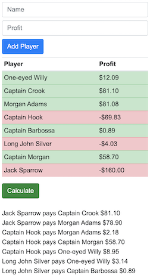

# Poker Settle Up Calculator

Simple application to optimally calculate who pays whom after a poker night.  See screenshot below.

Deployed to http://poker-settle-up-calculator.s3-website-us-east-1.amazonaws.com/

## Screenshot

## Development server
Run `ng serve` for a dev server. Navigate to `http://localhost:4200/`. The app will automatically reload if you change any of the source files.

## Build
Run `ng build` to build the project. The build artifacts will be stored in the `dist/` directory. Use the `-prod` flag for a production build.

## License
This code is under the [Apache Licence v2](https://www.apache.org/licenses/LICENSE-2.0).
